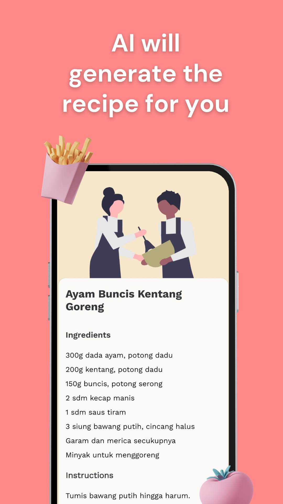
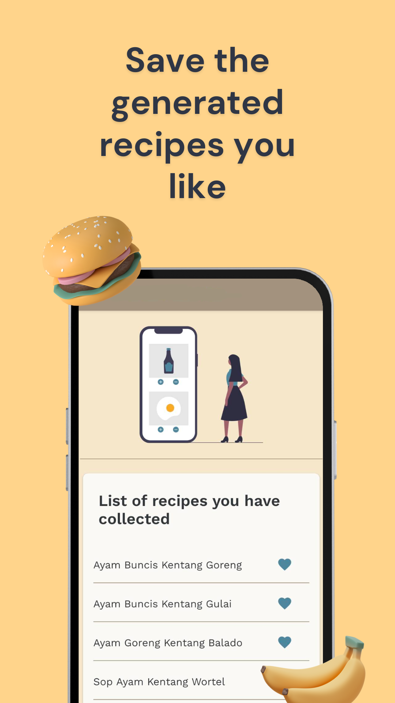

<h1>Overview</h1>
Besok Masak is an Android application that utilizes AI to generate recipe ideas based on user-provided ingredients. The app aims to reduce food waste and inspire culinary creativity.
   

           

 
<h2>Tech Stack</h2>
Frontend: Kotlin, MVVM, Coroutines, Flow, Dagger Hilt, AdMob, Room
Backend: Firebase Auth, Firebase Datastore, Firebase Crashlytics, Google Cloud Run, Node.js

<h2>Features</h2>
<li>AI-powered recipe generation based on user-provided ingredients and cooking method</li>
<li>User-friendly interface for inputting ingredients and preferences</li>
<li>AdMob integration for monetization</li>
<li>Offline functionality to access saved recipes using Room database</li>
<li>User authentication and data storage with Firebase Auth and Firebase Datastore</li>
<li>Crash reporting and analytics with Firebase Crashlytics</li>
<li>Scalable backend infrastructure using Google Cloud Run and Node.js</li>

<h2>Architecture</h2>
<li>MVVM: Separates concerns between Model, View, and ViewModel for better maintainability and testability.</li>
<li>Coroutines and Flow: Handles asynchronous operations efficiently and manages data flow.</li>
<li>Dagger Hilt: Manages dependency injection for singleton and testability.</li>
<li>Room: Provides local data storage for offline functionality.</li>
<li>Firebase: Handles user authentication, data storage, and crash reporting.</li>
<li>Google Cloud Run: Deploys the backend API for scalability.</li>
<li>Node.js: Implements the backend logic for recipe generation and other API endpoints.</li>
